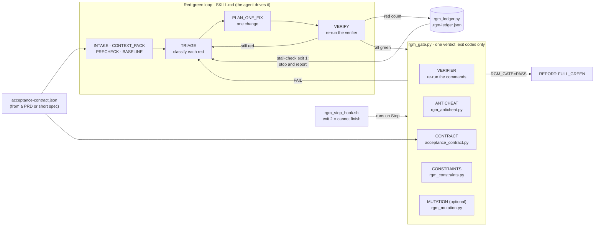

# red-green-mode

**Your coding agent says the tests are green. These seven CLIs check whether it cheated to get there.**

[English](README.md) · [中文](README.zh.md)

## Architecture



The agent runs the loop. Every judgment that decides "done" comes from a tool's exit code, never from
the agent's own report. The stop hook is optional and Claude Code only: with it installed, a failing
gate physically blocks the agent from ending its turn.

Coding agents are graded by their own test suite, so the cheapest way to "pass" is to attack the grader:
delete the assertion, `@pytest.mark.skip` the failure, sprinkle `# type: ignore`, or write a test that
never had teeth in the first place. You get a green checkmark and a broken product.

`red-green-mode` is a referee. Zero dependencies, pure Python stdlib, no network, no LLM calls —
just deterministic exit codes that any agent, any language, any CI can consume.

**Measured, not just described** ([`bench/`](bench/README.md)): against 55 seeded cheats across Python, JS/TS,
Go, Rust and CI config, the anti-cheat scanner blocks **55/55**. On 630 real merged PRs from 21 popular repos
(Flask, Pydantic, Vite, Zod, GitHub CLI, Tokio…), its PR-review profile blocks **3.3%**, and a hand audit of
every one of those blocks found no false detection. Reproducible from a committed manifest.

---

## 30 seconds, on your machine

```bash
git clone https://github.com/hidevinliu/red-green-mode ~/rgm && export RGM=~/rgm
mkdir -p /tmp/demo && cd /tmp/demo && git init -q .
```

A function with a real bug, and a test that catches it:

```python
# billing.py
def apply_discount(price, pct):
    return price - price * pct / 100

# test_billing.py
def test_rejects_over_100():
    try:
        apply_discount(100, 150)
    except ValueError:
        return
    raise AssertionError("should reject pct > 100")
```

### Gate 1 — did it fix the code, or fix the test?

A lazy agent "fixes" it without touching `billing.py`:

```diff
+@pytest.mark.skip(reason="flaky")
 def test_rejects_over_100():
-    try:
-        apply_discount(100, 150)
-    except ValueError:
-        return
-    raise AssertionError("should reject pct > 100")
+    assert True
```

```console
$ python3 -m pytest -q
1 passed, 1 skipped          # ← the agent reports success

$ git diff > /tmp/d.diff
$ python3 $RGM/tools/rgm_anticheat.py scan --diff-file /tmp/d.diff --format sentinel
ANTICHEAT=FAIL
FINDINGS=2
WARNINGS=0
ALLOWS=0
$ echo $?
1
```

Now the honest fix — add the missing guard clause to `billing.py`, leave the test alone:

```console
$ python3 -m pytest -q
2 passed

$ git diff > /tmp/honest.diff
$ python3 $RGM/tools/rgm_anticheat.py scan --diff-file /tmp/honest.diff
{"clean": true, "findings": [], "allows": []}
$ echo $?
0
```

Same green suite. Opposite verdict.

### Gate 2 — is the test even biting the code?

Anti-cheat only sees what changed. A test that was toothless from birth passes it clean.
So the second gate mutates your production code and demands the test go red:

```python
# test_dead.py — green forever, tests nothing
def test_it_runs():
    try:
        apply_discount(100, 10)
    except Exception:
        pass
```

```console
$ python3 $RGM/tools/rgm_mutation.py check-pair \
    --verifier "python3 -m pytest -q test_dead.py" \
    --target "billing.py::apply_discount" --format sentinel
RGM_MUTATION=FAIL
pair target=billing.py::apply_discount DEAD (survived 6/6)
$ echo $?
1
```

```console
$ python3 $RGM/tools/rgm_mutation.py check-pair \
    --verifier "python3 -m pytest -q test_billing.py" \
    --target "billing.py::apply_discount" --format sentinel
RGM_MUTATION=PASS
pair target=billing.py::apply_discount ALIVE (killed by: L2:'if not 0 <= pct <= 100:')
$ echo $?
0
```

Six mutations injected, six restored byte-for-byte (`finally` + on-disk sidecar + a `restore`
subcommand for crash recovery). Your working tree is unchanged afterward.

---

## What's in the box

Seven tools that return an exit code. Nothing here asks a model for an opinion.

| Tool | Question it answers | Exit codes |
|---|---|---|
| `rgm_anticheat.py` | Did this diff *introduce* a way to fake green? | `0` clean · `1` cheat found · `2` unusable |
| `rgm_mutation.py` | Does the verifier actually bite the target, or is it a dead target? | `0` ALIVE · `1` DEAD |
| `acceptance_contract.py` | Are the acceptance criteria well-formed, and did anyone swap a verifier for `echo PASS` after we agreed on it? | `0` valid + attestation matches · `1` drift |
| `rgm_ledger.py stall-check` | Is the loop making progress, or just burning tokens? | `0` progressing · `1` stalled |
| `rgm_partition.py` | Can these units really run in parallel without stepping on each other? | `0` disjoint · `1` overlap |
| `rgm_constraints.py` | Did the run write to a path the repo declared off-limits? | `0` respected · `1` violated |
| `rgm_gate.py` | All of the above, one verdict, one sentinel for a hook to grep. | `0` PASS · `1` FAIL · `2` error |

**Anti-cheat rules** (10 categories — 8 blocking, 2 advisory): test skips in Python / JS-TS / Go-Rust
(including marker aliases, `pytestmark`, `it.todo`, `#[ignore = "…"]`, `//go:build ignore`),
static-analysis suppressions (`# noqa`, `# pyright: ignore`, `@ts-ignore`, `@ts-expect-error`, `//nolint`,
`eslint-disable`, `#[allow(...)]`), trivially-true or neutralised assertions (`assert x or True`,
`if False:`, `except AssertionError`), *deleted* or rewritten assertions and tests, narrowed test selection
(`--deselect`, `-k "not …"`, `collect_ignore`, `testPathIgnorePatterns`), linter or CI strictness downgrades
(`continue-on-error: true`, `pytest || true`), plus two warn-only smells (mocking the thing under test,
"hardcoded to pass the test" comments). Assertions that were only moved are not findings.

It only reads the added/removed lines of a diff — a `# type: ignore` that was already in your
codebase is not this run's crime.

**Escape hatch.** Sometimes skipping a test is legitimate. Write the reason inline:

```python
@pytest.mark.skip(reason="upstream API down")  # rgm-allow: vendor outage, ticket OPS-412
```

The finding is downgraded to `allowed` and the reason is written into the run ledger.
The difference between cheating and a judgment call is whether you left an auditable reason.

---

## Install

```bash
git clone https://github.com/hidevinliu/red-green-mode
python3 -m pytest red-green-mode/tests/ -q      # 380 passed in ~30s
```

**Requirements:** Python 3.9+ and `git`. That's it — the tools import nothing outside the standard
library. `pytest` is only needed to run *this repo's* own test suite, not to use the tools on your
project. There is no package to install, no server to start, no config file to write.

### As a Claude Code / Codex skill

```bash
git clone https://github.com/hidevinliu/red-green-mode ~/.claude/skills/red-green-mode
```

`SKILL.md` then triggers on phrases like *"keep fixing until the tests pass"* / *"红绿灯模式"*
and drives the loop: pick a verifier → run → classify the red → fix → re-run → run the gate before
declaring done.

**Skills alone are advice.** A model that decides to stop can stop. For an actual block, wire the
Stop hook (`tools/rgm_stop_hook.sh`) into `settings.json` — it exits `2` when the gate fails,
and it is fail-closed: if the gate itself can't run, you still don't get to finish.
See [`tools/STOP-HOOK-INSTALL.md`](tools/STOP-HOOK-INSTALL.md).

### Companion skill: `mutation-check`

Want Gate 2 on its own, without the full loop? `skills/mutation-check/` is a separate skill that
triggers on *"is this test testing anything?"* / *"find dead tests"* and drives `rgm_mutation.py`
directly:

```bash
ln -s ~/.claude/skills/red-green-mode/skills/mutation-check ~/.claude/skills/mutation-check
```

### In CI, with no agent involved

`rgm_anticheat.py` is just a diff scanner. It works on human pull requests too. Use `--profile review`
there: humans legitimately rewrite assertions and add suppressions, so those become warnings, while skips,
net loss of assertions or tests, and narrowed test selection still block (3.3% of merged PRs in
[the benchmark](bench/README.md)):

```yaml
- name: Block test-tampering in this PR
  run: |
    git diff origin/${{ github.base_ref }}...HEAD > /tmp/pr.diff
    python3 tools/rgm_anticheat.py scan --diff-file /tmp/pr.diff --profile review --format sentinel
```

---

## What this does *not* do

Read [`tools/ANTICHEAT-LIMITATIONS.md`](tools/ANTICHEAT-LIMITATIONS.md) before you trust it. The
short version of the two that matter most:

- **Production-code gaming is largely undetected.** If the agent hardcodes `return 90` in
  `billing.py` so the test passes, regex over a diff will not catch it. Mutation testing partly
  covers this by asking whether the test has teeth, but "agent writes wrong-but-tested code" is an
  open problem, not a solved one.
- **The ledger is trusted input.** `rgm_gate.py` executes the verifier commands it finds there via
  a shell. Anyone who can write your ledger can make the gate run arbitrary commands and return
  PASS. Treat the ledger exactly like a `Makefile`: it is code, review it as code.

Also honest about scope: the `evals/` directory holds 53 hand-written scenario rubrics with **no
automated runner**. They are a human review checklist, not a passing benchmark. Don't read them as
"53 evals green".

---

## Prior art, and where this sits

- [`nizos/tdd-guard`](https://github.com/nizos/tdd-guard) blocks the agent *before* it writes code
  without a failing test. This project judges *after*: the suite is green — is it green for a real
  reason? Complementary, not competing.
- Anthropic's built-in verification loop gets an agent to re-run its own checks. It does not ask
  whether the agent tampered with the checks. That gap is the entire point of this repo.
- Academic work is converging on the same problem from the benchmark side — SpecBench, EvilGenie,
  TRACE. This is the small, boring, exit-code-shaped version you can put in a hook today.

## License

MIT — see [LICENSE](LICENSE).
