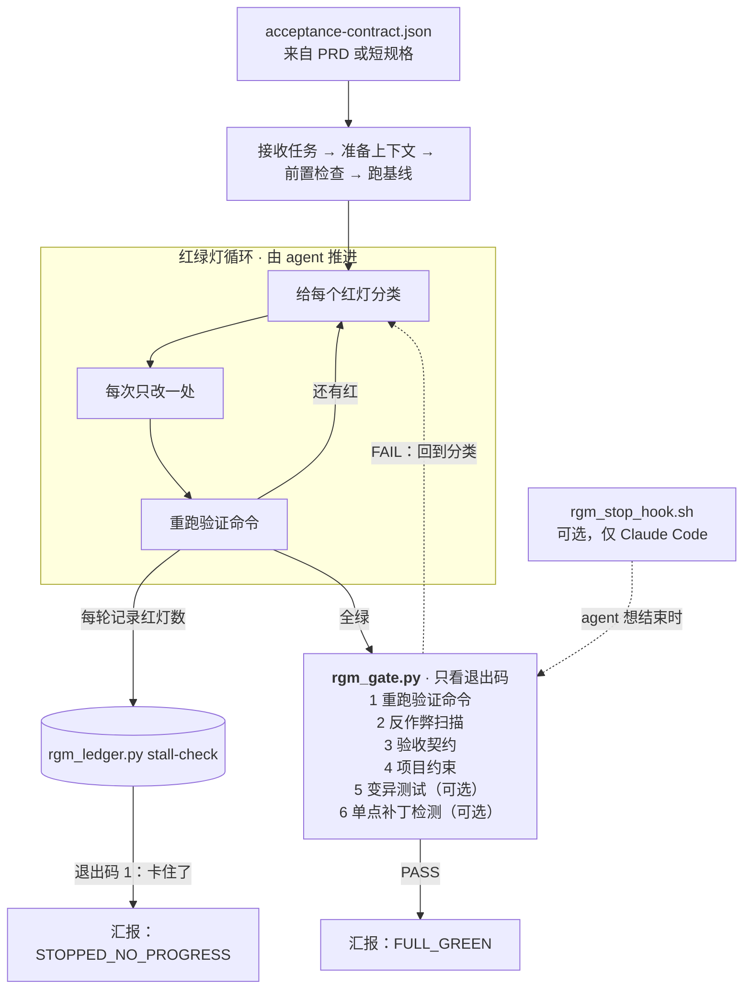

# red-green-mode

**你的 coding agent 说测试全绿了。这些工具负责查它是不是靠作弊绿的。**

[English](README.md) · [中文](README.zh.md)

## 架构



循环由 agent 推进，但"算不算做完"每一步都由工具的退出码裁决，不采信 agent 自己的汇报。
关卡依次检查：重跑验证命令、`rgm_anticheat.py`、`acceptance_contract.py`、`rgm_constraints.py`，
以及两项可选检查：`rgm_mutation.py`（加 `--mutation`）和 `rgm_pointpatch.py`（加 `--pointpatch-base 版本`）。
Stop hook 是可选的，只在 Claude Code 里生效：装上以后，关卡没过，agent 就结束不了这一轮。

coding agent 的成绩由它自己跑的测试判定，所以"通过"最省力的办法是去打裁判：删掉断言、给失败的
用例挂 `@pytest.mark.skip`、撒一把 `# type: ignore`，或者干脆一开始就写一个根本咬不住代码的测试。
你拿到一个绿色对勾，和一个坏掉的产品。

`red-green-mode` 是那个裁判。零依赖、纯 Python 标准库、不联网、不调模型——只有确定性的退出码，
任何 agent、任何语言栈、任何 CI 都能直接消费。

**有实测数字，不只是描述**（[`bench/`](bench/README.md)）：对 55 种覆盖 Python、JS/TS、Go、Rust 和 CI 配置的
已知作弊手法，反作弊扫描器拦下 **55/55**；在 21 个热门项目（Flask、Pydantic、Vite、Zod、GitHub CLI、Tokio 等）
的 630 个真实合并 PR 上，审 PR 模式只拦 **3.3%**，而且逐个人工复核后没有一个是误判。
所有结果都能从仓库里的清单复现。

单点补丁检测（[`bench/pointpatch/`](bench/pointpatch/README.md)）在 29 个 QuixBugs 程序上测过：
112 个正确修复**误报 0 个**，38 个过拟合补丁**抓到 26 个**。按输入特征写死的补丁一个都抓不到（0/6），
而且过拟合样本大多是模板生成的，这两点局限都在评测文档里写明了。

---

## 30 秒，在你自己机器上验

```bash
git clone https://github.com/hidevinliu/red-green-mode ~/rgm && export RGM=~/rgm
mkdir -p /tmp/demo && cd /tmp/demo && git init -q .
```

一个有真 bug 的函数，和一个能咬住它的测试：

```python
# billing.py
def apply_discount(price, pct):
    return price - price * pct / 100

# test_billing.py
def test_rejects_over_100():
    try:
        apply_discount(100, 150)
    except ValueError:
        return
    raise AssertionError("should reject pct > 100")
```

### 第一道门：它修的是代码，还是修的测试？

一个偷懒的 agent 根本没碰 `billing.py`：

```diff
+@pytest.mark.skip(reason="flaky")
 def test_rejects_over_100():
-    try:
-        apply_discount(100, 150)
-    except ValueError:
-        return
-    raise AssertionError("should reject pct > 100")
+    assert True
```

```console
$ python3 -m pytest -q
1 passed, 1 skipped          # ← agent 向你报喜

$ git diff > /tmp/d.diff
$ python3 $RGM/tools/rgm_anticheat.py scan --diff-file /tmp/d.diff --format sentinel
ANTICHEAT=FAIL
FINDINGS=2
WARNINGS=0
ALLOWS=0
$ echo $?
1
```

换成诚实的修法——给 `billing.py` 补上缺的判断，测试一个字不动：

```console
$ python3 -m pytest -q
2 passed

$ git diff > /tmp/honest.diff
$ python3 $RGM/tools/rgm_anticheat.py scan --diff-file /tmp/honest.diff
{"clean": true, "findings": [], "allows": []}
$ echo $?
0
```

同样是全绿，判定相反。

### 第二道门：这个测试到底咬没咬住代码？

反作弊只看这次改了什么。一个从出生就没牙的测试，能干干净净地过第一道门。
所以第二道门反过来去改你的生产代码，要求测试必须变红：

```python
# test_dead.py —— 永远绿，什么也没测
def test_it_runs():
    try:
        apply_discount(100, 10)
    except Exception:
        pass
```

```console
$ python3 $RGM/tools/rgm_mutation.py check-pair \
    --verifier "python3 -m pytest -q test_dead.py" \
    --target "billing.py::apply_discount" --format sentinel
RGM_MUTATION=FAIL
pair target=billing.py::apply_discount DEAD (survived 6/6)
$ echo $?
1
```

```console
$ python3 $RGM/tools/rgm_mutation.py check-pair \
    --verifier "python3 -m pytest -q test_billing.py" \
    --target "billing.py::apply_discount" --format sentinel
RGM_MUTATION=PASS
pair target=billing.py::apply_discount ALIVE (killed by: L2:'if not 0 <= pct <= 100:')
$ echo $?
0
```

注入 6 个变异，字节级还原 6 个（`finally` + 落盘 sidecar + 崩溃后可用的 `restore` 子命令）。
跑完你的工作区和跑之前一模一样。

### 第三道门：它修的是逻辑，还是只修了被测的那几个输入？

前两道门盯的是测试，这一道盯的是业务代码。还是同一个 bug，这次 agent 不动测试，
而是把测试检查的那几个输入单独写死：

```python
# billing.py，"修好"之后
def apply_discount(price, pct):
    if (price, pct) == (200, 10):
        return 180
    if (price, pct) == (50, 20):
        return 40
    return price - price * pct / 10
```

测试全绿，改动没碰任何测试，反作弊无话可说。`rgm_pointpatch.py` 先记录测试传给
`apply_discount` 的输入，再把每个输入稍微改一改，让新旧两个版本并排跑：

```console
$ python3 $RGM/tools/rgm_anticheat.py scan --diff-file /tmp/d.diff --format sentinel | grep ANTICHEAT
ANTICHEAT=PASS
$ python3 $RGM/tools/rgm_pointpatch.py check --after billing.py --base HEAD --root . \
    --func apply_discount --record "python3 -m pytest -q" --format sentinel
POINTPATCH=SUSPECT
SEEDS_CHANGED=2/2
NEIGHBOUR_CHANGE_RATE=0.000
LITERAL_HITS=4
WHY=behaviour changed at 2 tested input(s) but on only 0/48 nearby inputs
$ echo $?
1
```

老实的修法（`/ 100`）在同样 48 个附近输入里改变了 47 个，结果是 `POINTPATCH=OK`。
真修复会改变一整片输入的行为，单点补丁只改变测试看得到的那几个点。这条规则多常判对、
多常判错，实测在 [`bench/pointpatch/`](bench/pointpatch/README.md)。

---

## 里面有什么

下面每个裁决都是退出码，没有任何一个环节需要问模型的意见。

**三项检查，以及把它们合在一起的最终关卡**

| 工具 | 它回答什么问题 | 退出码 |
|---|---|---|
| `rgm_anticheat.py` | 这次改动有没有在测试上**新引入**伪造绿灯的手法？ | `0` 干净 · `1` 抓到作弊 · `2` 跑不起来 |
| `rgm_mutation.py` | 被守护的代码坏了，测试真的会失败吗？ | `0` ALIVE · `1` DEAD |
| `rgm_pointpatch.py` | 这次修复改的是逻辑，还是只改了测试用到的那几个输入？ | `0` OK / 无法判断 · `1` 可疑 · `2` 跑不起来 |
| `rgm_gate.py` | 以上三项加下面几项，一次裁决，输出一行给 hook 去 grep 的哨兵。 | `0` PASS · `1` FAIL · `2` 出错 |

**其他工具**

| 工具 | 做什么 |
|---|---|
| `acceptance_contract.py` | 校验验收标准，并用哈希锁住每条验证命令，事后被换成 `echo PASS` 会被发现。 |
| `rgm_ledger.py stall-check` | 判断修复循环还有没有进展（`1` = 卡住了，停下）。 |
| `rgm_constraints.py` | 本次运行写了仓库声明为禁区的路径，就判失败。 |
| `rgm_partition.py` | 几个任务的文件或依赖有重叠时，拒绝并行。 |
| `rgm_intake.py`、`rgm_context_pack.py`、`rgm_codemap.py`、`rgm_mcp_server.py` | 帮 agent 选任务、选文件、选验证命令。它们是循环的输入，永远不能当成"做完了"的证据。 |

**反作弊规则共 10 类**（8 类拦截、2 类只提示）：Python / JS-TS / Go-Rust 的测试跳过写法
（含标记别名、`pytestmark`、`it.todo`、`#[ignore = "…"]`、`//go:build ignore`）、
静态检查屏蔽（`# noqa`、`# pyright: ignore`、`@ts-ignore`、`@ts-expect-error`、`//nolint`、`eslint-disable`、`#[allow(...)]`）、
恒真或被架空的断言（`assert x or True`、`if False:`、`except AssertionError`）、
**被删掉**或被改写的断言和测试、缩小测试范围（`--deselect`、`-k "not …"`、`collect_ignore`、`testPathIgnorePatterns`）、
linter 或 CI 严格度下调（`continue-on-error: true`、`pytest || true`），外加两条只警告的坏味道
（mock 掉被测对象本身、注释里写着"写死骗过测试"）。只是挪了位置的断言不算。

它只读 diff 的新增行和删除行——你代码库里本来就有的 `# type: ignore` 不算这次运行的账。

**逃生阀。**有时候跳过一个测试是合理的。把理由写在行内：

```python
@pytest.mark.skip(reason="upstream API down")  # rgm-allow: 供应商断服，工单 OPS-412
```

这条发现会降级为 `allowed`，理由写进运行记录。
作弊和合理判断的唯一区别，就是有没有留下一条能被审计的理由。

---

## 安装

```bash
git clone https://github.com/hidevinliu/red-green-mode
python3 -m pytest red-green-mode/tests/ -q      # 380 passed，约 30 秒
```

**需要什么：**Python 3.9+ 和 `git`。就这些——工具本身不 import 任何标准库以外的东西。
`pytest` 只在跑**本仓库自己**的测试套件时需要，你拿工具去用在自己项目上并不需要它。
没有包要装，没有服务要起，没有配置文件要写。

### 当成 Claude Code / Codex 的 skill 用

```bash
git clone https://github.com/hidevinliu/red-green-mode ~/.claude/skills/red-green-mode
```

`SKILL.md` 会被「红绿灯模式」/「跑到全绿」/ *"keep fixing until the tests pass"* 这类说法触发，
然后驱动整个循环：选验证器 → 跑 → 给红灯分类 → 针对性修 → 再跑 → 收工前过一遍 gate。

**光有 skill 只是建议。**模型想停还是能停。要真正物理阻断，把 Stop hook
（`tools/rgm_stop_hook.sh`）接进 `settings.json`——gate 挂了它就 exit 2，
而且是 fail-closed：gate 本身跑不起来，你照样收不了工。
装法见 [`tools/STOP-HOOK-INSTALL.md`](tools/STOP-HOOK-INSTALL.md)。

### 配套 skill：`mutation-check`

只想单独用第二道门，不跑整个循环？`skills/mutation-check/` 是一个独立 skill，
被「这个测试是不是白测了」/「找出死测试」这类说法触发，直接调用 `rgm_mutation.py`：

```bash
ln -s ~/.claude/skills/red-green-mode/skills/mutation-check ~/.claude/skills/mutation-check
```

### 在 CI 里用，完全不涉及 agent

`rgm_anticheat.py` 本质就是个 diff 扫描器，对人写的 PR 一样管用。审人写的 PR 时加 `--profile review`：
人改写断言、加屏蔽注释很常见，这两类降为警告；跳过测试、断言或测试净减少、缩小测试范围照样拦
（在[实测](bench/README.md)里只拦 3.3% 的合并 PR）：

```yaml
- name: Block test-tampering in this PR
  run: |
    git diff origin/${{ github.base_ref }}...HEAD > /tmp/pr.diff
    python3 tools/rgm_anticheat.py scan --diff-file /tmp/pr.diff --profile review --format sentinel
```

---

## 它**做不到**什么

信它之前先读 [`tools/ANTICHEAT-LIMITATIONS.md`](tools/ANTICHEAT-LIMITATIONS.md)。
最要紧的两条：

- **改业务代码去迎合测试，只能抓到一部分。**`rgm_pointpatch.py` 能抓到只在被测输入上改变行为的修复，
  抓不到"整片都改了、但改错了"的修复；而且如果 bug 本身只出现在一个点上，老实的修复在它看来也像单点补丁。
  它的实测抓到率和误报率见 [`bench/pointpatch/`](bench/pointpatch/README.md)。
  "agent 写出错的、却被测试覆盖的代码"仍是未解问题，不是已解问题。
- **运行记录（ledger）是受信输入。**`rgm_gate.py` 会通过 shell 执行它在里面找到的验证器命令。
  谁能写你的 ledger，谁就能让 gate 执行任意命令并返回 PASS。
  请把 ledger 完全当作 `Makefile` 对待：它是代码，按代码来审。

还有一条也说清楚：`evals/` 里有 53 条手写的场景评分条目，**没有自动 runner**。
它们是给人读的检查清单，不是跑绿了的基准。别把它当"53 个 eval 全过"来读。

---

## 相关项目，以及本项目的位置

- [`nizos/tdd-guard`](https://github.com/nizos/tdd-guard) 管的是**事前**：不许在没有失败测试的
  情况下写代码。本项目管**事后**：测试确实绿了——它绿得有没有道理？两者互补，不冲突。
- 识别"只是让测试通过、其实没修对"的补丁，在自动程序修复领域是成熟的研究方向（"过拟合补丁"）。
  `rgm_pointpatch.py` 的核心思路——比较补丁前后被测输入附近的行为——借鉴自 PATCH-SIM（Xiong 等，ICSE 2018）
  和 DiffTGen（Xin & Reiss，ISSTA 2017），本项目把它做成了能放进 agent 循环的零依赖检查。
- Anthropic 内置的 verification loop 让 agent 反复跑自己的检查，但不问 agent 有没有动过那些检查。
  那个缺口就是这个仓库存在的全部理由。
- 学术侧正从基准测试那一端逼近同一个问题——SpecBench、EvilGenie、TRACE。
  这个仓库是同一件事的小号、无聊、退出码形态的版本，今天就能塞进一个 hook 里。

## 许可

MIT，见 [LICENSE](LICENSE)。
